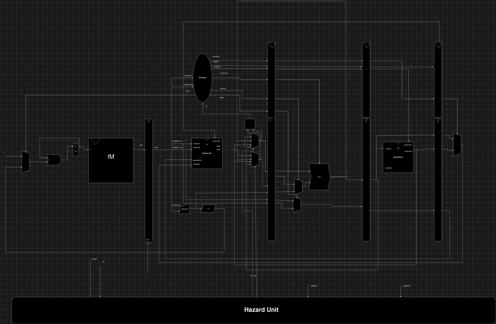

# 32-Bit-MIPS-Pipelined-Processor 

## Introduction

- An implementation to *h&h* 32 bit MIPS Pipelined processor with some nuances.
- The microarchitecture is quite different from *h&h*, I customized various aspects to it the main change was:
    - Changing the forward sink to the decode stage instead of the execute stage  
        - reasons : 
            1. Less wire cluttering.
            2. No need for forward logic of the branch instruction because the sink is already at the decode stage.
            3. Some downs is that the $T_c$ kinda increased by very small fraction which might be neglected (due to the increase of critical path, specifically $T_{mem} + {T_{mux}}$).
    - Decreased the hardware by one adder by inserting a tiny 2 to 1 mux in the PC increment logic.
- The microarchitecture is synthesizeableISH.
- You can find the design [here as image](Microarch-Design/microarch.jpg) and [here as pdf](Microarch-Design/microarch_grid.pdf).

    

## Dependencies 
- python
- GTKwave or any wave simulator (for simulation purposes)

## Simulation

- To dump your program to the instruction memory insert [this](#snippets-to-insert) to the [instruction memory](Instruction-Memory/instruction_memory.v) file 
- Run `python Helpers/maketest.py <testbench>.v` with the appropriate hex file, you can view the outputs at `<testbench>.vcd` 

## Snippets to insert
 1. `
    initial
        $readmemh("<program>.hex", data);
`
